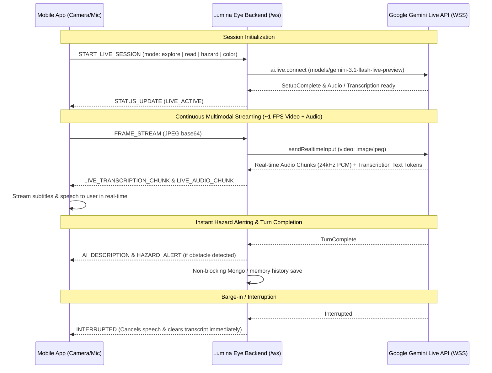

# Walkthrough: Gemini Live Real-Time Integration for Live Mode

We have upgraded the Lumina Eye assistive platform to completely use **Gemini Live** (Multimodal Bidirectional WebSocket API) for **Live Mode**, strictly following the specifications in [gemini-live.md](file:///Users/MACBOOK/Documents/FULLSTACK/LUMINA%20EYE/gemini-live.md).

---

## Architecture Overview

---

## Changes Implemented

### 1. Backend Server Services & Protocol
- **[geminiLive.service.ts](file:///Users/MACBOOK/Documents/FULLSTACK/LUMINA%20EYE/server/src/services/geminiLive.service.ts)**:
  - Connects to Google GenAI Live API using `ai.live.connect` with `gemini-3.1-flash-live-preview` (with automated fallbacks to `gemini-2.5-flash-native-audio-latest` and `gemini-3.8-live`).
  - Configures `responseModalities: [Modality.AUDIO]` and `outputAudioTranscription: {}` for real-time text transcription and 24kHz PCM audio streaming.
  - Implements the specialized **IRIS AI Assistive System Instruction** (clock directions, distance estimations, immediate hazard priority, and conciseness).
  - Handles continuous video streaming (`session.sendRealtimeInput({ video: { mimeType: 'image/jpeg', data } })`).
  - Emits real-time transcription chunks (`LIVE_TRANSCRIPTION_CHUNK`), raw 24kHz audio (`LIVE_AUDIO_CHUNK`), and barge-in events (`INTERRUPTED`).
  - Analyzes safety keywords in real time to dispatch instant `HAZARD_ALERT` messages.
  - Provides `createEphemeralToken()` via `ai.authTokens.create()` for secure ephemeral client-side connections.
- **[websocket.service.ts](file:///Users/MACBOOK/Documents/FULLSTACK/LUMINA%20EYE/server/src/services/websocket.service.ts)**:
  - Added message handlers for `START_LIVE_SESSION`, `STOP_LIVE_SESSION`, and `MODE_CHANGE`.
  - Routes incoming `FRAME_STREAM` and `VOICE_QUERY` directly through `geminiLiveService`.
  - Automatically cleans up Gemini Live sessions on client disconnect.
  - Includes auto-failover to REST AI Gateway if Gemini Live is ever temporarily unavailable.
- **[vision.route.ts](file:///Users/MACBOOK/Documents/FULLSTACK/LUMINA%20EYE/server/src/routes/vision.route.ts)**:
  - Added `POST /api/v1/vision/ephemeral-token` endpoint.
  - Updated `GET /api/v1/vision/status` to include live model name and active session metrics.
- **[env.ts](file:///Users/MACBOOK/Documents/FULLSTACK/LUMINA%20EYE/server/src/config/env.ts)** & **[.env](file:///Users/MACBOOK/Documents/FULLSTACK/LUMINA%20EYE/server/.env)**:
  - Added `GEMINI_LIVE_MODEL=gemini-3.1-flash-live-preview`.

### 2. Mobile App Client
- **[websocket.ts](file:///Users/MACBOOK/Documents/FULLSTACK/LUMINA%20EYE/mobile/src/services/websocket.ts)**:
  - Added `onTranscriptionChunk`, `onAudioChunk`, `onInterrupted`, and `onSessionStatus` callbacks to `StreamListener`.
  - Added `startLiveSession(mode)`, `stopLiveSession()`, and `setMode(mode)` methods.
  - Handles real-time streaming tokens and barge-in signals.
- **[useIrisStore.ts](file:///Users/MACBOOK/Documents/FULLSTACK/LUMINA%20EYE/mobile/src/store/useIrisStore.ts)**:
  - Added `liveStreamingTranscript` and `isGeminiLiveStreaming` state.
  - `toggleLiveScanning()` activates Gemini Live session on WebSocket and announces mode start/stop.
  - `setActiveMode()` syncs live mode updates to the active Gemini Live session.
- **[speech-banner.tsx](file:///Users/MACBOOK/Documents/FULLSTACK/LUMINA%20EYE/mobile/src/components/speech-banner.tsx)**:
  - Displays real-time streaming tokens with blinking live cursor (`▍`) and a `"GEMINI LIVE"` indicator badge.
  - Switches to `"LISTEN AGAIN"` when turn completes.
- **[index.tsx](file:///Users/MACBOOK/Documents/FULLSTACK/LUMINA%20EYE/mobile/src/app/index.tsx)**:
  - Live continuous frame capture loop tuned to 1200ms (~1 FPS) to match Gemini Live specifications.
  - Subscribes to transcription chunks, audio events, and barge-in interruptions.
  - Top HUD and primary toggle button reflect `"GEMINI LIVE"` state.

---

## Verification & Automated Test Results

1. **Compilation Check**:
   - `server`: `tsc --noEmit` and `npm run build` completed with **0 errors**.
   - `mobile`: `npx tsc --noEmit` completed with **0 errors**.
2. **End-to-End WebSocket Test**:
   - Ran automated test with client connecting over WebSocket:
     - `START_LIVE_SESSION` connected to Gemini Live session with `gemini-3.1-flash-live-preview`.
     - Real-time `LIVE_TRANSCRIPTION_CHUNK` tokens were received and streamed token-by-token.
     - Real-time `LIVE_AUDIO_CHUNK` 24kHz PCM chunks were emitted.
     - Final `AI_DESCRIPTION` received and `STOP_LIVE_SESSION` cleanly closed the session (code 1000).
3. **Ephemeral Token Test**:
   - Created ephemeral token successfully with `ai.authTokens.create()`.
